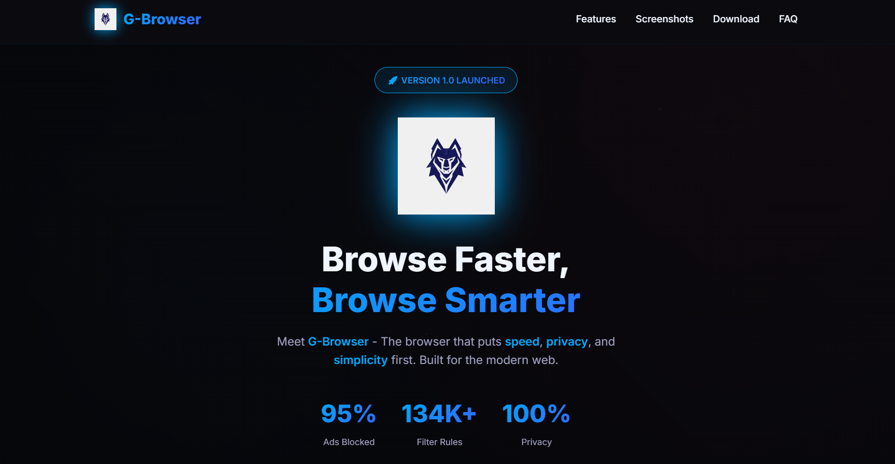

# 🐺 G-Browser (v1.0)

> **A custom-built desktop Web Browser with silent ad-blocking, neon UI, session restore & wolf-themed identity.**

---

## 🚀 Overview

**G-Browser** is a fully functional desktop web browser built using **Electron.js** — featuring a custom multi-tab engine, network-level ad-blocker, cyber-style UI, session restore, bookmarks manager, and a history timeline.

This isn’t a toy project. **This is a complete system-level browser.**

---

## 📸 Screenshots

  
  &nbsp; &nbsp;
  

---

## 🔥 Core Features (v1.0)

### 🟦 Multi-Tab Engine
* Smooth custom tab bar
* Dynamic tab titles
* Neon loading indicator
* Auto URL syncing

### 🟩 Silent Built-in Ad Blocker
* Network-level request filtering
* Blocks ads before they load
* YouTube ads blocked after first retry
* **Zero popups, zero slowdown**

### 🟧 Neon Bookmarks Sidebar
* Slide-out neon panel
* One-click bookmarking
* Persistent JSON storage
* **Shortcut:** `Ctrl + B`

### 🟨 History Timeline
* “Today / Yesterday / Older” sections
* Searchable & Auto-saved
* **Shortcut:** `Ctrl + H`

### 🟪 Cyber Settings Page
* Choose homepage
* Select search engine (Google / Bing / Brave / DDG)
* Toggle ad-blocker & Session restore
* Clear history/bookmarks
* **Shortcut:** `Ctrl + ,`

### 🟥 Session Restore
* Saves open tabs on exit
* Reloads them on next startup
* **Works even after system reboot**

---

## 📥 Download G-Browser

👉 **Website:** [Visit G-Browser Website](https://guru1316.github.io/G-Browser-Website/)

👉 **OS:** Windows 64-bit (.exe installer)

---

## 🐺 Brand Identity – Wolf

G-Browser uses a wolf theme representing:
* **Speed**
* **Precision**
* **Focus**
* **Independence**
* **Adaptability**

---

## 🎯 Version 2 (Coming Soon)

* [ ] Full Downloads Manager
* [ ] Stronger YouTube Ad Block
* [ ] Themes (Neon, Matrix, Firefox Purple)
* [ ] Extensions Sandbox
* [ ] Performance boost
* [ ] New Tab Dashboard

---

## 🛠️ Tech Stack

* **Electron.js**
* **Node.js**
* **HTML / CSS / JS**
* **JSON-based local storage**
* IPC communication
* Request interception APIs

---

## ⭐ Show your support

Feel free to **star ⭐ the repo** if you like the project!

---

## 🔗 License

**MIT License © Guru**
